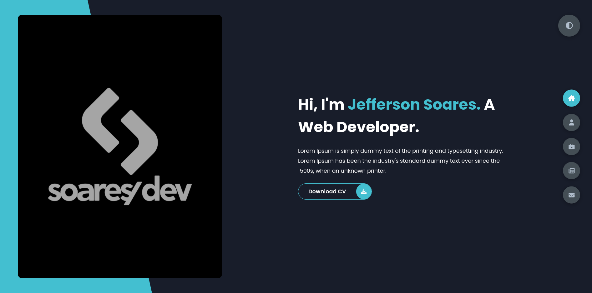
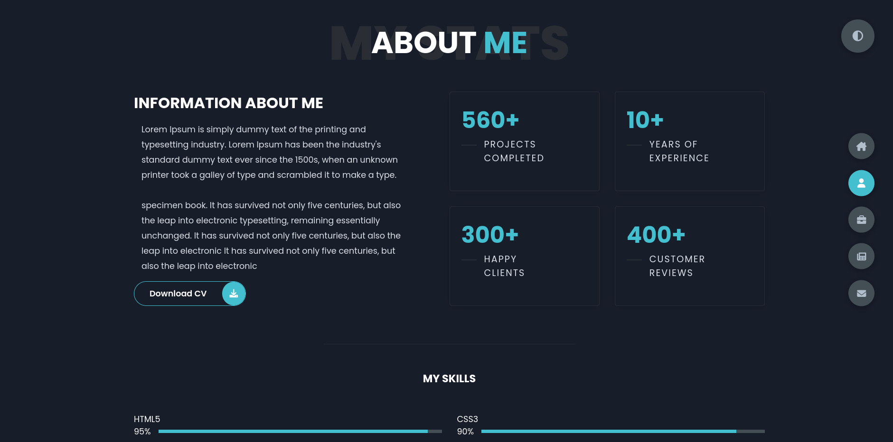
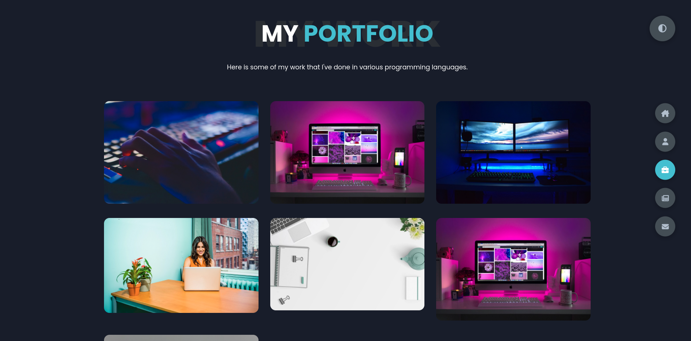
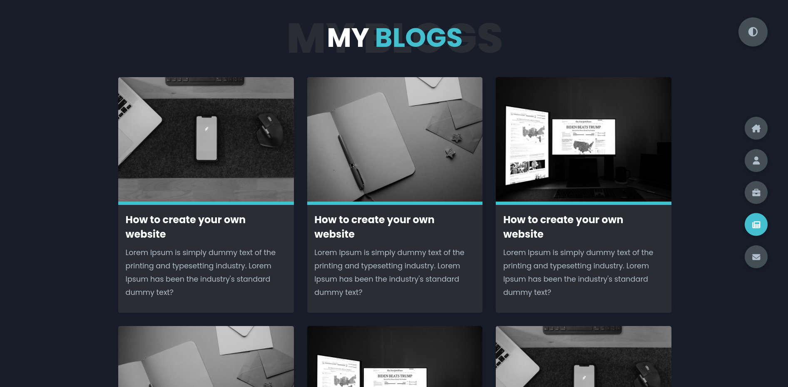

<h2 align="center">
  Portfolio Website Example
</h2>

<p align="center">
  
</p>

<p align="center">
  

  

  
</p>

<br>

### :writing_hand: About this project
This is a portfolio theme site, for the development I used html, css and javascript technologies also some responsive design techniques


### :cyclone: How to run this project
```bash
# Clone this repository
$ git clone https://github.com/jefferson1104/portfolio-website.git

# Access the project folder
$ cd portfolio-website

# Open 'index.html' with your browser

```
### 🎨 Screenshots
<p align="center">
  
  
  
  
</p>